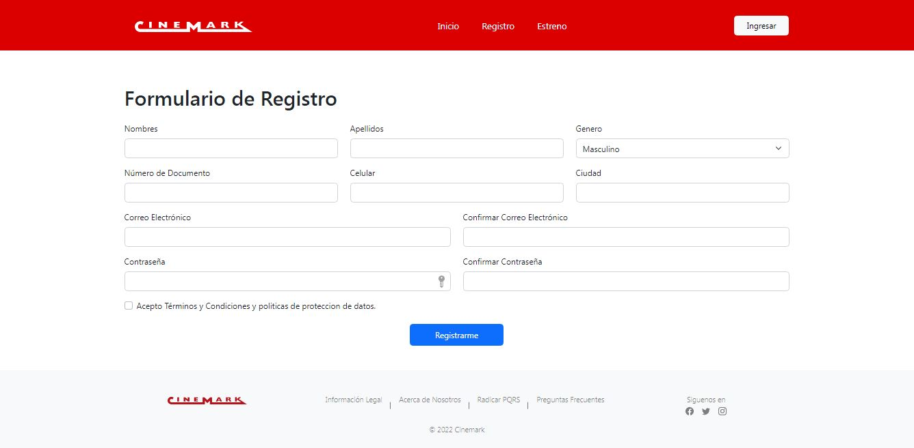
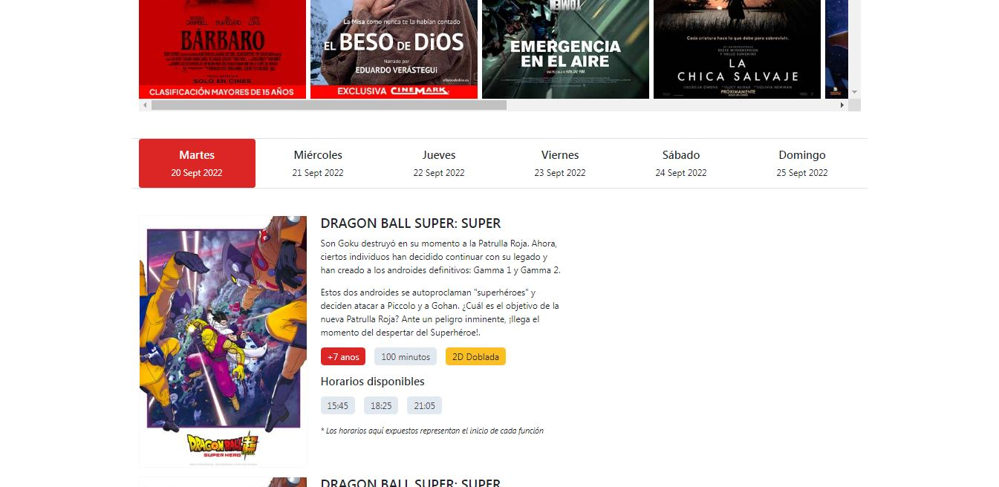

<div align="center">
🚀 Proyecto todavia en proceso...
</div>
<br/>

# Proyecto Cinemark - Gran Plaza El Ensueño

## Create a virtual env

Cuando descargamos el projecto debemos crear un ambiente virtual a través del siguiente comando

```python
python3 -m venv env
```

Luego activamos nuestro ambiente virtual

```bash
# linux
. env/bin/activate 

# windows
./env/bin/activate 
```

### Install requirements

Debemos instalar todas las dependencias necesarias para que el projecto funcione, utilizando el comando

```python
pip install -r requirement.txt
```

### Initial server

Para iniciar el servidor de manera local debemos utilizar el siguiente comando en la terminal

```python
flask --app ./src/app --debug run 
```

_Nota: Debe ubicarse en el carpeta raiz (backend)_

## Problematica

Gran Plaza El Ensueño - Cinemark requiere un sistema para la venta de entradas a las películas disponibles que posee en cartelera.

Los tipos de usuarios que debe manejar el sistema son superadministrador, administrador, y usuario final.
Un usuario final de la plataforma debe estar en la capacidad de poder registrarse, buscar películas, comprar tiquete, puntuar y comentar la película, y gestionar sus comentarios realizados.

Un administrador se encarga de gestionar las películas, decidir cuales están en cartelera y cuáles no, asignar un cupo máximo de tiquetes por función, y gestionar los usuarios.
Un superadministrador ejerce el control total de la plataforma, usuarios y películas.

## Screen (MockUp)

### Pagina principal

Propuesta para ser la pagina principal de Cinemark.


### Pagina de Registro

El usuario podrá registrarse sin ningún cargo para tener acceso a los beneficios de ser cliente VIP.


### Pagina de Estrenos

Esta pagina se encargará de darle la posibilidad al usuario final comprar las boletas que desea.



